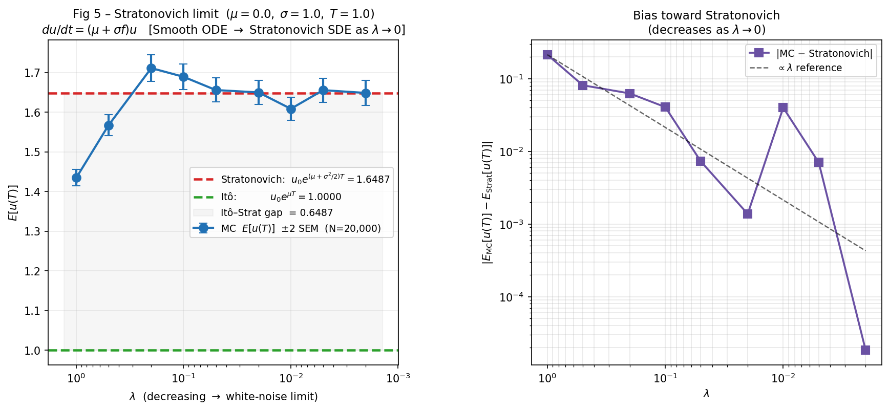

# Stochastic SDE Modeling: Itô vs. Stratonovich Limits

Numerical simulations for stochastic differential equations (SDEs), originally developed for CL 677 at IIT Bombay. 

This project applies the Euler-Maruyama scheme and large-scale Monte Carlo ensembles (20,000+ iterations) to simulate geometric random walks. It statistically validates the fundamental differences in expected values and long-term behavior between the Itô and Stratonovich interpretations of multiplicative noise.

## 🛠 Tech Stack
* **Language:** Python
* **Libraries:** NumPy, SciPy, Matplotlib

## 📂 Repository Structure
* `/src` — Core simulation and plotting script (`CL677_projectscript_final.py`).
* `/report` — Detailed mathematical methodology, derivations, and proofs (PDF).
* `/visuals` — Generated probability distributions, covariance kernels, and convergence plots.

## 📊 Key Result
*The simulation explicitly demonstrates how a smooth ordinary differential equation tracks the Stratonovich mean as the noise limit approaches zero, departing entirely from the Itô expectation.*



## 🚀 Quick Start
Clone the repository and execute the master script to run the simulations and generate all statistical figures:

```bash
git clone [https://github.com/vachaaan/stochastic-modeling-sde.git](https://github.com/vachaaan/stochastic-modeling-sde.git)
cd stochastic-modeling-sde
python src/CL677_projectscript_final.py
